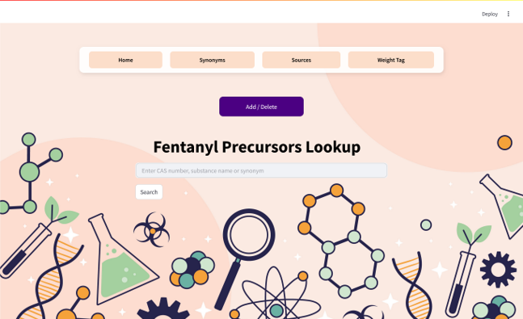

# 💊 Disrupting Fentanyl Supply Chains: ISO Chemical ID Mappers

## 📘 Project Overview
The **Chemical ID Mappers** team is part of the broader **Illicit Synthetic Opioids (ISO) Disruption Framework**, focused on mapping chemical identifiers across different substance registries to aid in tracking illicit fentanyl production and distribution.

## 🎯 Objectives
- **Standardize chemical identifiers**: Map chemical IDs across registries such as PubChem and the DEA Controlled Substance Act Scheduling List.
- **Resolve chemical name variations**: Identify and normalize synonyms to improve searchability and tracking.
- **Automate identification methods**: Develop scripts and tools to automate the process of linking identifiers across different sources.
- **Support policy and law enforcement efforts**: Provide structured data that can assist in combating illicit fentanyl trafficking.

## 🔍 Methodology
1. **Data Collection**: Gather chemical data from various registries (PubChem, DEA, etc.).
2. **Data Normalization**: Standardize chemical names and identifiers for consistency.
3. **Mapping & Linking**: Create a structured database that links chemical identifiers across different sources.
4. **Validation & Verification**: Ensure accuracy by cross-referencing multiple data sources.
5. **Automation & Scalability**: Implement big data methodologies to handle large datasets efficiently.

## 🛠️ Tools & Technologies
- **Python**: For data processing and automation.
- **SQL & NoSQL Databases**: For structured data storage and retrieval.
- **Big Data Platforms**: AWS, Google Colab, or similar cloud-based solutions.
- **APIs**: Integration with PubChem, DEA databases, and other chemical registries.
- **GitHub**: Version control and collaboration.

## 💻 User Interface (Streamlit App)

To make the Chemical ID Mapper more accessible for analysts, researchers, and policymakers, a **Streamlit-based web interface** was developed as the frontend layer over the curated chemical database.

### 🔍 Fentanyl Precursors Lookup Portal



The UI allows users to:
- **Search** substances using a **CAS number**, **chemical name**, or **synonym**.
- **View fuzzy and exact matches** dynamically, with scores, match type, and reference links.
- **Add/Delete** records (for authorized users) to simulate data extension and curation workflows.
- **Navigate** through structured views for:
  - **Synonyms**
  - **Sources**
  - **Weight Tags** (CSA Schedules, Illicit classification, etc.)

### 📦 Data Model Integration


The interface is powered by a backend API (FastAPI) that interacts with the curated database (see ER diagram for structure). Tables include:
- `Substance_Reference`: Central chemical substance records
- `Substance_Sourcing`: Linked source records (DEA, PubChem, etc.)
- `Substance_Weighting_Tag`: Legal/forensic classifications
- `Substance_Type`: Groupings (e.g., U-series, nitazenes, analogues)

Each search query:
- Runs through six matching scenarios (fuzzy + exact, across CAS/name/synonym)
- Returns **interpretable results** with real-time feedback on substance identification quality

### 🧪 Example Use Case

> A forensic analyst enters a partial name like *"benzylamin"*. The tool detects it as *"Benzylamine"*, shows a match score, CAS number, registry links, and classification under the Controlled Substance Act—all within seconds.

## 🧠 Analytic/Algorithm Details

### 🧮 Analytic/Algorithm Name
- **Regex (Pattern Matching)**: Uses regular expressions to extract chemical identifiers (like CAS numbers) from text data.
- **Fuzzy Matching**: Matches chemical names that are similar but not exactly the same, such as when there are typos or slight variations in spelling.
- **Canonicalization**: Converts all variations of a chemical name or identifier into a single, standard format for easier comparison.
- **Entity Resolution**: Detect and combine data that pertain to the same chemical but have distinct IDs, synonyms, or substance names using blocking and clustering algorithms.

### 📚 Datasets
- Chemical identifier datasets from **PubChem**, **DEA Controlled Substance Act Scheduling List**, and other chemical registries.
- Publicly available datasets related to illicit synthetic opioids and fentanyl precursors.
- Custom-labeled datasets created by the team for entity resolution and validation.

### 🖥️ Computer Resources Required
- High-performance computing resources including:
  - **Large CPU** for processing massive datasets.
  - **GPU** for the acceleration of machine learning-based entity resolution.
  - **Cloud resources** (AWS, Google Cloud, etc.) for scalable computation.
  - **Local development environments** (laptops with sufficient processing power for testing and debugging).

## 📁 Repository Structure
```
/ (Root)
│── data/                # Raw and processed datasets
│ └── screenshots/       # Images and UI screenshots
│── scripts/             # Python scripts for processing and mapping
│ └── ui/                # UI Front and Backend
│ └── Web Scraping/      # Code for web scraping tasks
│── docs/                # Project documentation
│── README.md            # Project overview
│── requirements.txt     # Dependencies
│── .gitignore           # Ignore unnecessary files
```

## 🤝 Contribution Guidelines
1. **Fork and Clone**: Clone the repository to your local machine.
2. **Create a Branch**: Use feature branches for new work (`feature-branch-name`).
3. **Commit and Push**: Write clear commit messages and push your changes.
4. **Pull Requests**: Submit a PR for review before merging.
5. **Code Review**: Review other contributors' PRs and provide feedback.

## 👥 Team Members
- **Brian Denis Castelino** - Product Owner
- **Saaketh Hota** - Scrum Master
- **Divya Bhargavi Tangirala** - Developer
- **Hanishka Reddy Kyatham** - Developer
- **Sriram Yatam** - Developer
- **Sai Sruthi Patibandla** - Developer

## 📬 Contact
For questions or contributions, reach out via GitHub issues or email **bcasteli@gmu.edu**.

---

This repository serves as the **Chemical ID Mappers** team's workspace for the **Illicit Synthetic Opioids (ISO) Project**. Stay updated with weekly progress and contributions!
